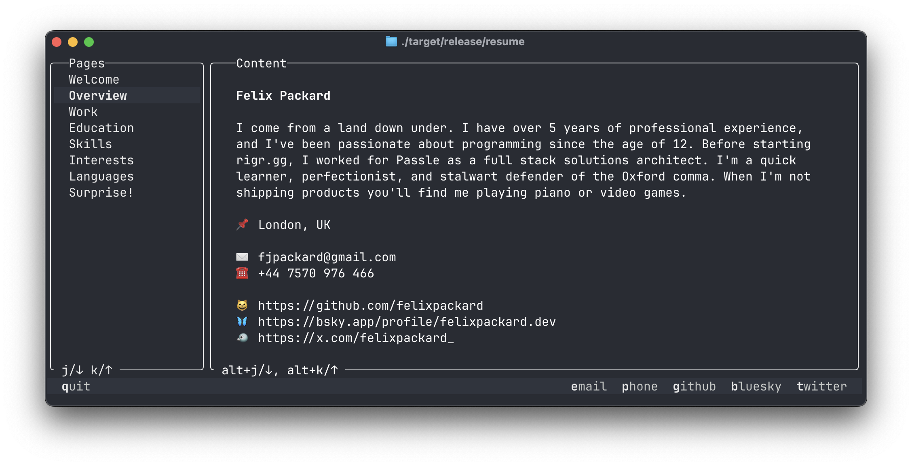

# Felix Packard's Resume



This repository contains my resume in JSON format, following the open source [JSON Resume](https://jsonresume.org/) schema. It is consumed by two packages:

- **CLI Application** (Rust, Cargo) - Renders resume fields in a terminal interface.
- **Web Application** (Bun, HTML) - Renders resume fields in a web page.

## Features
- [Bespoke CLI resume viewer](./packages/cli) written in Rust with navigation, custom date parsing/formatting logic, and external links
- [Web-based resume](./packages/web) using Bun, [resumed](https://github.com/rbardini/resumed) and [jsonresume-theme-even](https://github.com/rbardini/jsonresume-theme-even/tree/main)

## Quick Start

To build and run the CLI on your own machine, just clone the repository and execute the `run-cli` task:

```sh
git clone https://github.com/felixpackard/resume
cd resume
make run-cli
```

## Building

```sh
# Build all packages
make build

# Build only the CLI package
make build-cli

# Build only the web package
make build-web

# Copy resume.json and schema.json into each individual package without building
make copy-files
```

## License
MIT License. See [LICENSE](LICENSE) for details.
